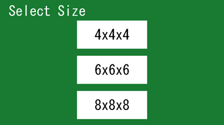
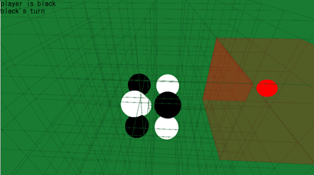
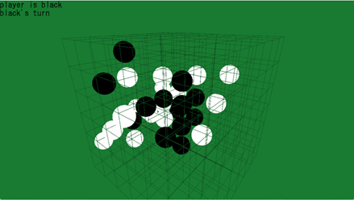

ビルドしなくてもmain.exeはbuildファイルの中にあります

## 準備
cmakeとコンパイラを用意する。\
ただしコンパイラは
>https://github.com/niXman/mingw-builds-binaries/releases の Release of 13.1.0-rt_v11-rev1のx86_64-13.1.0-release-posix-seh-msvcrt-rt_v11-rev1.7zをダウンロードし展開したものを用いる

## ビルド方法
Windows pwsh&Cドライブ直下を想定

1.git clone する
```
git clone https://github.com/SakuAndKou/3DOthello.git
```
2.buildフォルダを作る
```
mkdir build && cd build
```
3.cmake
```
cmake .. -G "MinGW Makefiles"
```
4.makeしてbuildする
```
C:\x86_64-13.1.0-release-posix-seh-msvcrt-rt_v11-rev1\mingw64\bin\mingw32-make.exe
```
5.実行
```
./main.exe
```

## 内容
3DOthelloです

ゲーム画面
|   |   |
|---|---|
|   |   |
|   |   |
## 操作方法
WASDで移動(shift+wsで上下移動)\
矢印キーかマウスのホイールを押し込んでドラックすることで視点移動\
マウスのホイールを回すことで奥行きの指定(赤い球)\
左クリックで駒を置く

